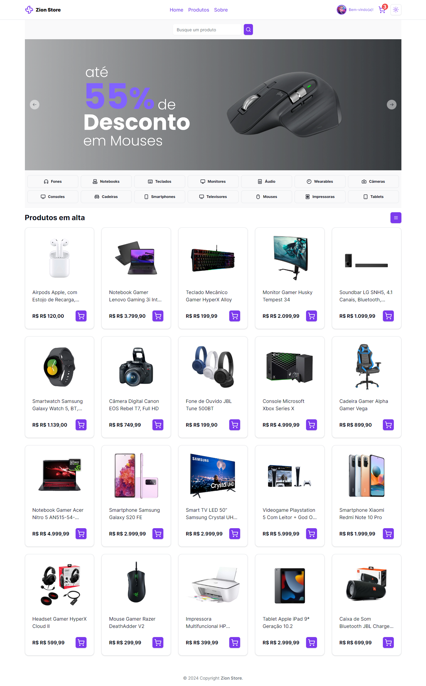
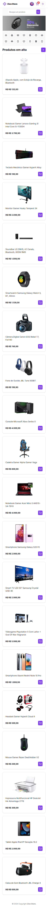

<div align="center">
<h1 style="font-weight: semibold; font-size: 32px;">Zion Store</h1>
<h2 align="center">Made with Next.js 14, Typescript and TailwindCSS. ⚛</h2>
</div>

&nbsp;

<p align="center">
  <a href="#Technologies">Technologies</a>&nbsp;&nbsp;&nbsp;|&nbsp;&nbsp;&nbsp;
  <a href="#Project">Project</a>&nbsp;&nbsp;&nbsp;|&nbsp;&nbsp;&nbsp;
  <a href="#License">License</a>
</p>

<p align="center">
 
  
  
</p>
&nbsp;
&nbsp;
&nbsp;

<div align="center">

  
  

</div>

&nbsp;

## 📖 Sobre o projeto

O projeto **Zion Store** é uma aplicação web de e-commerce desenvolvida com Next.js, Typescript e TailwindCSS. O projeto foi desenvolvido com o intuito de aprimorar os conhecimentos nas tecnologias utilizadas, bem como aprofundar os estudos em desenvolvimento web. A escolha por Next.js se deu pensando em performance e SEO. Next.js é um framework baseado em React, desenvolvido pela [Vercel](https://vercel.com) que traz funcionalidades como SSR, otimização de imagens e SEO dinâmico. Unido ao poder do Next.js, Typescript, um superset Javascript, permite a escrita de um código limpo e mais seguro. A escolha de TailwindCSS, framework desenvolvido pensando em Utility-first, foi para priorizar a entrega rápida e também para facilitar a criação da aplicação no modo responsivo.

## 💻 Tecnologias utilizadas no projeto

- [Next.js](https://nextjs.org/)
- [Typescript](https://www.typescriptlang.org/)
- [TailwindCSS](https://tailwindcss.com/)
- [shadcn-ui](https://shadcn-ui.com/)

## 🌿 Branches

- `main` projeto finalizado.

## 🎨 Protótipo do projeto

O protótipo do projeto foi feito baseado nos principais sites de comércio eletrônico do Brasil.

Você pode visualizar o deploy da aplicação [aqui](https://ecommerce-teste-f.vercel.app).

## 📝 Licença

Este projeto está sob a licença MIT. Consulte a [LICENÇA](./LICENSE) para obter mais informações.

## 🗄️ Estrutura de pastas

O projeto está estruturado da seguinte forma:

- 📁 `public`
- 📁 `src`
  - 📁 `app`
    - 📁 `cart`
    - 📁 `categories`
    - 📁 `products`
    - 📁 `search`
    - ⚛️ `page.tsx`
    - ⚛️ `layout.tsx`
    - ⚛️ `globals.css`
  - 📁 `components`
    - 📁 `ui`
    - 📁 `layout`
    - 📁 `constants`
    - 📁 `contexts`

## 🛠️ Instruções de execução

Siga as instruções abaixo para rodar o projeto em seu ambiente local:

1. Certifique-se de ter o Node.js instalado em seu computador. Você pode baixar a versão mais recente do Node.js [aqui](https://nodejs.org).

2. Clone este repositório em seu computador ou faça o download do código fonte.

```bash
  git clone https://github.com/jhonatan-oliveiradev/ecommerce-teste-f.git
```

3. Abra o terminal e navegue até o diretório raiz do projeto.

4. Instale as dependências do projeto executando o seguinte comando:

```bash
  npm install
```

5. Após a conclusão da instalação das dependências, inicie o servidor de desenvolvimento local com o comando:

```bash
  npm run dev

  ou

  yarn dev
```

6. O servidor local será iniciado e você poderá acessar o projeto no seu navegador através do seguinte endereço:

```bash
  http://localhost:3000
```

Caso a porta 3000 estiver em uso, automaticamente o Next.js irá subir na próxima porta livre da máquina.

Se deseja alterar a porta padrão na qual a aplicação tentará subir, você pode modificar a porta no arquivo `next.config.js`.

Agora você está pronto para explorar o projeto em seu ambiente local!

## 🛠️ Instruções de execução do mock de API local

Para rodar o mock de API local, siga as instruções abaixo:

1. Abra o terminal e navegue até o diretório raiz do projeto.

2. Execute o seguinte comando para subir o servidor de mock de API:

```bash
  npm run json-server

  ou

  yarn json-server
```

3. O servidor de mock de API será iniciado e você poderá acessar o projeto no seu navegador através do seguinte endereço:

```bash
  http://localhost:3333
```

Agora você está pronto para explorar o projeto em seu ambiente local com o mock de API!

## 🚀 Deploy

Para realizar o deploy do projeto, você pode utilizar o Vercel, plataforma de deploy da Next.js.

1. Acesse o site da [Vercel](https://vercel.com) e crie uma conta.

2. Após criar a conta, clique em "Import Project" e selecione o repositório do projeto.

3. Configure as variáveis de ambiente necessárias para o projeto.

4. Clique em "Deploy" e aguarde o deploy ser finalizado.

Agora você tem o projeto disponível em produção!

<hr>

<div align="center">

Feito com 💜 por [Jhonatan Oliveira](https://jhonatanoliveira.com).

</div>